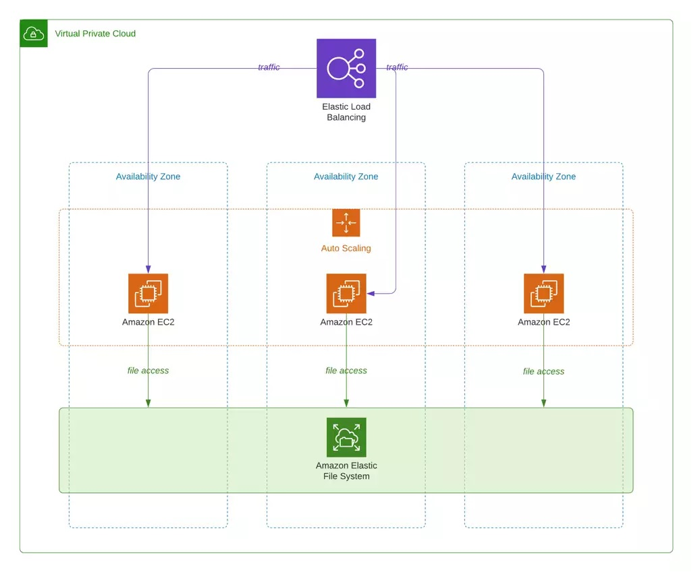

## UI Deploy (Angular + AWS EC2 + AWS AutoScaling + AWS Pipeline)

## Objective

- Deploy an Angular application directly EFS
- Use AWS Code Pipeline to build and deploy the files on EFS directly
- Create an auto Scaling feature and boot strap script
- Based on this article: https://blog.shikisoft.com/deploy-to-amazon-efs-with-aws-codebuild-codepipeline/



## Configurations

- Create EFS
- Create a private subnet. (Simple Subnet)
- Create a routing table a associate with the private subnet.
- Create a NAT Gateway on public subnet
- On the routing table created. add a routing to 0.0.0.0/0 to the Nat gateway created.
- Create AWS Pipeline with the build in the private sub net.
- Add the EFS on the AWS Build

## BootStrap Script for AutoScaling

1) Change the ID of the EFS accordingly
```sh
    #!/bin/bash
    sudo su
    sudo amazon-linux-extras enable nginx1
    sudo yum install nginx -y
    cd /
    mkdir /mnt/efs/
    sudo mount -t nfs4 -o nfsvers=4.1,rsize=1048576,wsize=1048576,hard,timeo=600,retrans=2,noresvport fs-027d9e36b1c2aec7e.efs.sa-east-1.amazonaws.com:/ /mnt/efs
    cd/
    cd /etc/nginx/
    sed -i 's/usr\/share\/nginx\/html/\mnt\/efs/g' nginx.conf
    sudo systemctl start nginx
```

